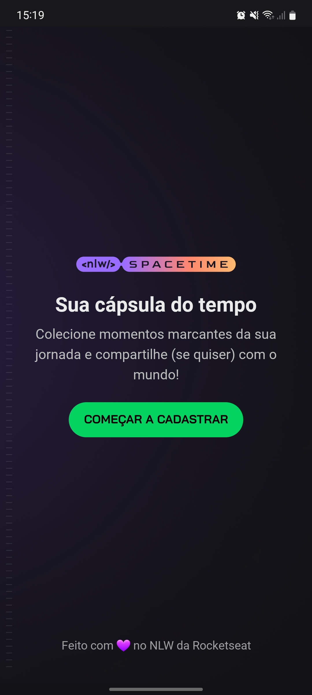
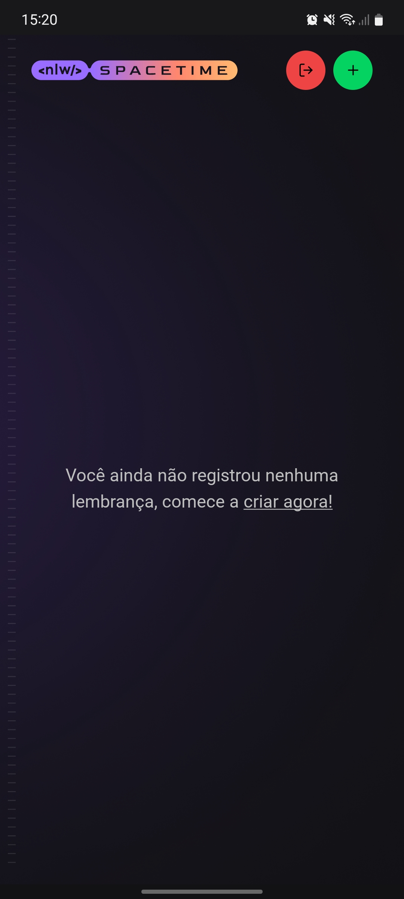
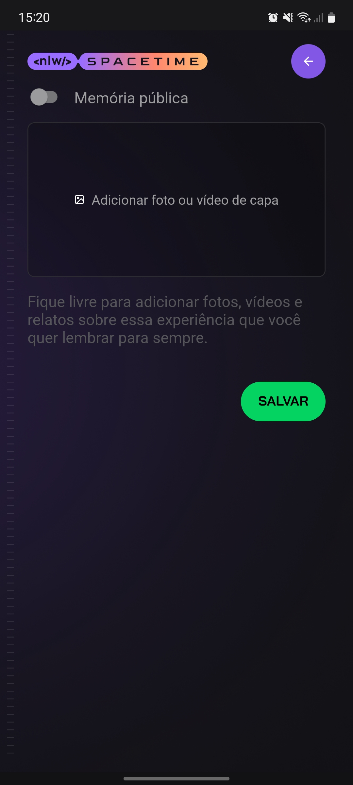
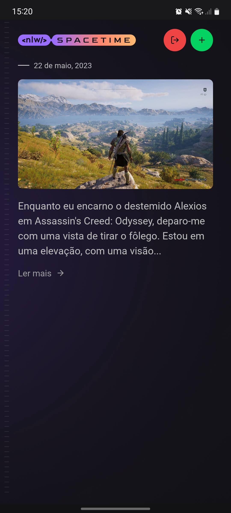

# Cápsula do Tempo - NLW Spacetime | Rocketseat

## Português

#### Aplicativo de registro de memórias

A aplicação foi desenvolvida em React Native com Expo, utilizando TypeScript, TailwindCSS e outras bibliotecas. Ela consome uma API REST que permite visualizar, cadastrar, editar e excluir memórias.

## English

#### Memory Recording App

The application was developed in React Native with Expo, using TypeScript, TailwindCSS, and other libraries. It consumes a REST API that allows viewing, creating, editing, and deleting memories.

## Screenshots

    

        
        
        
        
        
    

## Video

https://github.com/alyssonbarrera/ignite-spacetime-mobile/assets/86618257/fb32ccbe-b7a3-4ddf-8ede-8a442e85bcba

## Stack

  
